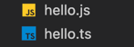

## ts是什么？
ts是一门静态类型的吧语言，它并不是代码编译完成之后才开始运行的，而是在我们写代码的时候就可以运行，并且能给我们检查错误的一种javascript的超级语言

## 能够解决什么问题？
它能够解决：比如我们定义一个变量的时候，变量的数据使用错误或者函数参数的时候，参数类型使用错误等的一些问题

## 发现问题
## 静态类型检测
## 非异常故障
### tsc编译器
> 前提：  
> 我们需要有node环境
### 全局安装 ts
```bash
npm i typescripy -g
```

这时我们进入到ts文件，并且编译ts语句
```bash
tsc hello.ts
```
这时会转为js 

运行js
```bash
node hello.js
```
结果： 


